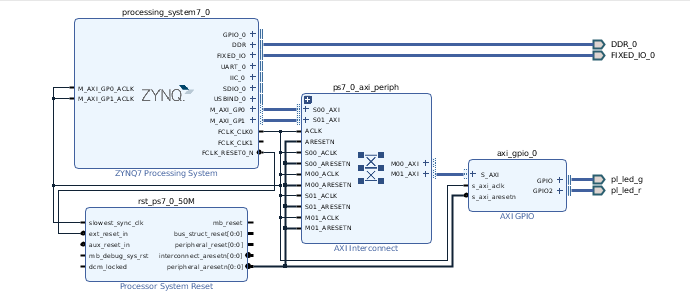
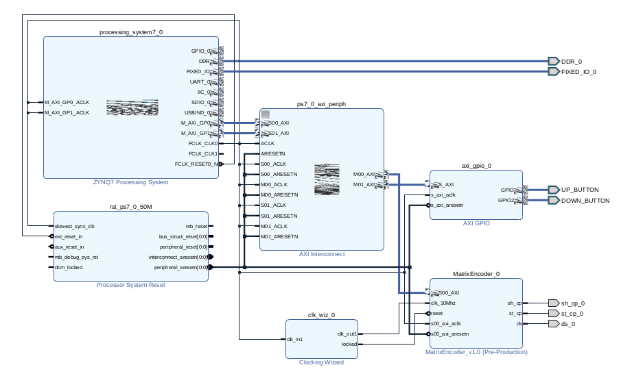

# TRY 1

Eerst hebben we geprobeerd om een simpel programma te maken dat de GPIO leds toggled adhv hetvolgende block design

<p align="center">
  
</p>

1. Created a petalinux project :
   - `petalinux-create --type project --template zynq --name test_gpio`
  
2. Read Hardware and configure gpio demo
   - `petalinux-config --get-hw-description="../path-here"`
   - `petalinux-config -c kernel`
      - enabled gpio demo app

3. Build kernel
   - `petalinux-build --avnet-image-full`
  
4. Boot QSPI
   - ./boot_qspi.INITRD.sh

5. login with root/root
6. List GPIO devices
   - ls /sys/class/gpio/
     - Gevonden aparaten
       - export
       - gpiochip1013  
       - gpiochip1021
       - gpiochip1022
       - gpiochip1023
       - unexport
  
7. Enabling gpio bit
   - `echo -n nummer > /sys/class/gpio/export`
   - `cat /sys/class/gpio/gpio902/direction out`
   - `echo 1 > /sys/class/gpio/gpio902/value`

<br>

**Bij deze poging geraakte we in de kernel die we gebuild hadden.
Maar de leds reageerde niet op de commands wat we ook probeerden.**

Gevolgde tutorials voor GPIO
   - <https://www.beyond-circuits.com/wordpress/2016/08/gpio-with-zynq-and-petalinux/>
   - <https://medium.com/@roymesi/gpio-and-petalinux-part-1-5cb6fc24d021>

<br><br>

# TRY 2

<p align="center">
  
</p>

Zelfde stappen uitgevoerd als in try 1 maar dan met matrixEncoder axi IP Block.

<br><br>

# TRY 3

BD design zie : /DEEL2/try3.pdf

1. In terminal in /home/USER:
	- `mkdir Avnet20201`
	- `cd Avnet20201`
	- `git clone https://github.com/Avnet/petalinux.git -b 2020.1`
	- `git clone https://github.com/Avnet/hdl.git -b 2020.1`
	- `git clone https://github.com/Avnet/bdf.git -b master`

<br>

2. Source environment with Vivado and petalinux settings
	- `source /opt/Xilinx/Vivado/2020.1/settings64.sh`
	- `source /opt/pkg/petalinux/settings.sh`

3. In terminal in /home/<USER>/Avnet202001/petalinux/scripts;
	
	- `./make_minized.sh`


4. In vivado - Clean File: 
	
   4a. Run project and create bitstream

	4b. EXPORT
      - File >> Export >> Export Hardware >> Expandable >> 
Pre-Synthesis [+include bitstream] >> Add constraints of this project

<br>

**Bij deze poging geraakte we ook in de kernel die we gebuild hadden.
Maar de leds reageerde ook wederom niet op de commands wat we ook probeerden.**

Gevolgde tutorials voor GPIO
   - <https://www.hackster.io/bartosz-rycko/minized-2020-1-getting-started-pynq-b39925#toc-vitis-platform-2>

<br><br>

# TRY 4

BD zie /DEEL2/try_4_bd.pdf

1. Creëren van minized BSP

```sh
mkdir Avnet20201;

cd Avnet20201;

git clone https://github.com/Avnet/petalinux.git -b 2020.1;

git clone https://github.com/Avnet/hdl.git -b 2020.1;

git clone https://github.com/Avnet/bdf.git -b master;
```

```sh
cd petalinux/scripts;

./make_minized.sh;
```

1. Aanpassen van generated block design naar custom
    - ZIE DEEL2/DIST/try_4_bd.pdf
  
2. Create petalinux project

```sh
petalinux-create -t project -s minized_2020_1.bsp -n MinizedFromBSP

cd MinizedFromBSP;

petalinux-config --get-hw-description=/home/bartek/Avnet20201/MzWorkInProgress/

petalinux-config -c kernel
```

3. Build kernel & flash

```sh
petalinux-build -c avnet-image-full;

./boot_qspi_INITRD.sh
```
## RESULT
Wanneer we deze image boote via de USB stick kregen we de volgende kernel panic
- Kernel panic - not syncing: Attempted to kill init! exitcode=0x0000000b

<br><br>

# TRY 5

BD zie /DEEL2/try5.pdf

1. In terminal in /home/USER:
	- `mkdir Avnet20201`
	- `cd Avnet20201`
	- `git clone https://github.com/Avnet/petalinux.git -b 2020.1`
	- `git clone https://github.com/Avnet/hdl.git -b 2020.1`
	- `git clone https://github.com/Avnet/bdf.git -b master`

<br>

2. Source environment with Vivado and petalinux settings
	- `source /opt/Xilinx/Vivado/2020.1/settings64.sh`
	- `source /opt/pkg/petalinux/settings.sh`

3. In terminal in /home/<USER>/Avnet202001/petalinux/scripts;
	
	- `./make_minized.sh`


4. In vivado - Clean File: 

   4a. Open block design
	
   4b. These 14 Blocks should be left:
      - axi_intc_0
   	- clk_wiz_0
   	- interrupt_concat
   	- proc_sys_reset_41MHz
   	- proc_sys_reset_50MHz
   	- proc_sys_reset_100MHz
   	- proc_sys_reset_142MHz
   	- proc_sys_reset_1661MHz
   	- proc_sys_reset_200MHz
   	- ps7
   	- ps7_axi_periph
   	- wireless_mgr_0
   	- xlconcat_0
   	- xlconstant_1 

   4c. Create bitstream

	4. EXPORT
      - File >> Export >> Export Hardware >> Expandable >> 
Pre-Synthesis [+include bitstream] >> Add constraints of this project

<br>

**Bij deze poging geraakte we ook in de kernel die we gebuild hadden.
Maar de leds reageerde ook wederom niet op de commands wat we ook probeerden.**

Gevolgde tutorials voor GPIO
   - <https://www.hackster.io/bartosz-rycko/minized-2020-1-getting-started-pynq-b39925#toc-vitis-platform-2>