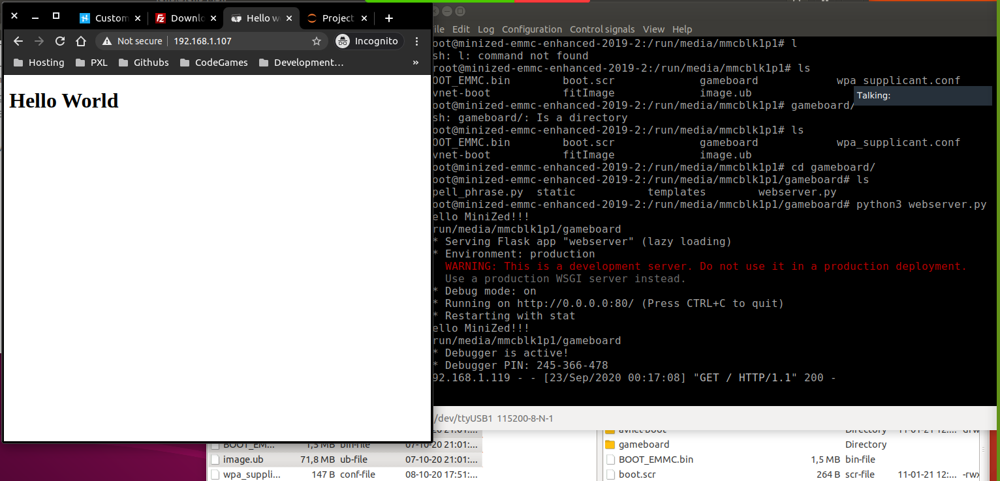

# TRY 1 - Volledig project

Zie onze tutorial: `/EXTRA/dist/Kasper&Jens_Stepstxt`

## RESULT
Het lukte ons ook hier om een kernel te builden maar pynq runde niet.

# TRY 2 - WERKENDE PYTHON SERVER

Tutorial link : <https://www.hackster.io/whitney-knitter/custom-webserver-on-the-minized-1a1b18>

Wanneer we deze tutorial uitvoerden kregen we een werkende webserver in python.

## RESULT

  

